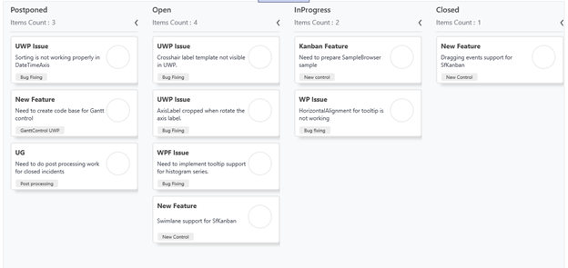

# How-to-add-shadow-effects-for-kanaban-cards-in-UWP
This article explains how to show shadow effects for Syncfusion UWP Kanban control cards as shown in below.


 
This has been achieved by getting the children from its control Loaded event and added show effect as per in below code snippet.

[XAML]

```
        <Grid.Resources>
                <DataTemplate x:Key="TagsTemplate">
                <Border Background="#FFEDEDED" CornerRadius="2" >
                    <TextBlock Text="{Binding}" HorizontalAlignment="Center"
                       TextTrimming="CharacterEllipsis" Margin="10,1,10,1"
                       FontSize="10" VerticalAlignment="Center"
                       Foreground="#FF454545" />
                </Border>
            </DataTemplate>
            <!--Default Card Template-->
            <DataTemplate x:Key="DefaultKanbanCardTemplate">
                <Grid Loaded="Grid_Loaded">
                    <Canvas x:Name="Shadow"></Canvas>
                    <Border BorderBrush="{Binding Tag.CardStyle.BorderBrush ,RelativeSource={RelativeSource Mode=TemplatedParent}}"
                BorderThickness="{Binding Tag.CardStyle.BorderThickness ,RelativeSource={RelativeSource Mode=TemplatedParent}}"
                CornerRadius="{Binding Tag.CardStyle.CornerRadius ,RelativeSource={RelativeSource Mode=TemplatedParent}}"
                MinHeight="100"
                Background="{Binding Tag.CardStyle.Background ,RelativeSource={RelativeSource Mode=TemplatedParent}}"
                MaxHeight="300"
                Height="Auto"
                Margin="0,6,0,6"
                >
…

                    </Border>
                </Grid>
            </DataTemplate>
        </Grid.Resources>

        <kanban:SfKanban x:Name="Kanban" CardTemplate="{StaticResource DefaultKanbanCardTemplate}"
                         ItemsSource="{Binding Tasks}" CardTapped="Kanban_CardTapped" AutoGenerateColumns="True">

        </kanban:SfKanban>
```
[C#]
MainWindow.xaml.cs

```
          private void Grid_Loaded(object sender, RoutedEventArgs e)
        {
            Grid rootGrid = sender as Grid;
            Canvas shadow = null;
            Border border = null;
            foreach (UIElement child in rootGrid.Children)
            {
                if (child is Canvas)
                {
                    shadow = child as Canvas;
                }
                else
                {
                    border = child as Border;
                    //To apply selected card style.
                    if (previousCard != null && (previousCard.Content as KanbanModel).Equals(rootGrid.DataContext as KanbanModel))
                    {
                        rootGrid.Background = new SolidColorBrush(Colors.Orange);
                        ((child as Border).FindName("KANBAN_Title") as TextBlock).Foreground = new SolidColorBrush(Colors.Red);
                        ((child as Border).FindName("KANBAN_Description") as TextBlock).Foreground = new SolidColorBrush(Colors.Red);
                    }
                }
            }

            var compositor = ElementCompositionPreview.GetElementVisual(border).Compositor;
            SpriteVisual spriteVisual = compositor.CreateSpriteVisual();
            spriteVisual.Size = new Vector2((float)border.ActualWidth, (float)border.ActualHeight);
            var dropShadow = compositor.CreateDropShadow();
            dropShadow.Offset = new Vector3(10, 10, 10);
            dropShadow.Color = Colors.LightGray;
            spriteVisual.Shadow = dropShadow;

            ElementCompositionPreview.SetElementChildVisual(shadow, spriteVisual);
        }
```

# See also

[How to customize the placeholder in UWP Kanban Board (SfKanban)](https://help.syncfusion.com/uwp/kanban-board/placeholderstyle)

[How to customize the kanban cards in UWP Kanban Board (SfKanban)](https://help.syncfusion.com/uwp/kanban-board/cards#customizing-kanban-cards)

[How to populate the kanban column with kanban cards from different categories](https://help.syncfusion.com/uwp/kanban-board/column#populate-the-column-with-cards-from-different-categories)

[How to customize the Kanban column header](https://help.syncfusion.com/uwp/kanban-board/column#headers)

[How to expand and collapse the Kanban column](https://help.syncfusion.com/uwp/kanban-board/column#expandcollapse-column)


